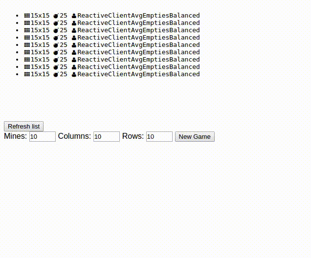
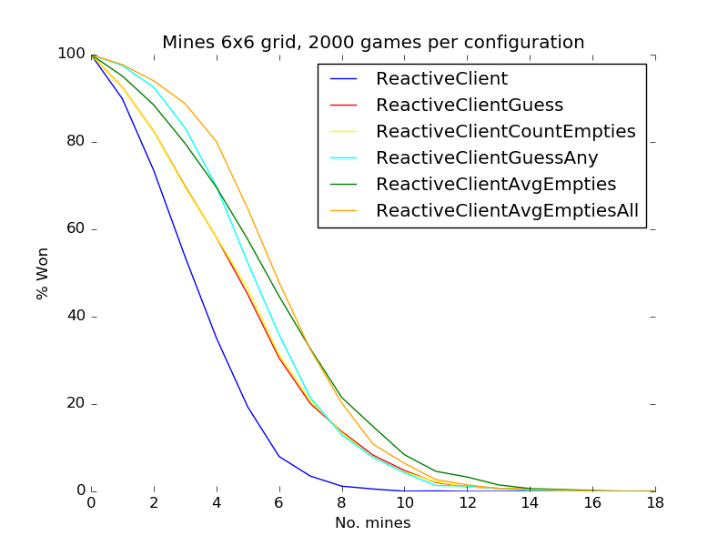

# Mines

A client-server system to allow AIs (and humans) to play minesweeper.

## JSON server

A Node.js/Express server which uses a JSON API to allow clients to start and play games. Games are stored in a MongoDB database.

## Clients

"AI"s written in Python and C#. Each language has a wrapper to communicate with the server.

There is also a native, simple Python server which can be used with Python clients, in place of the JSON server.

## Game Viewer

A React-based single-page GUI for viewing played games. Also allows humans to start and play a game on the server.

## Graph plotter

A graph plotter to view the success rate of different clients under different game parameters. The native Python server allows many thousands of games to be played quickly, producing accurate success rate figures.

